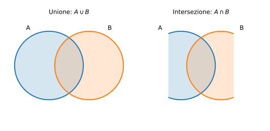
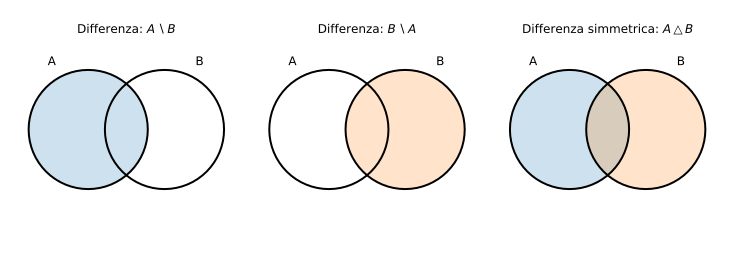

# Esempi ed esercizi — 1.1 Insiemi

Teoria: [1.1 Insiemi](../../01-concetti-di-base/1.1-insiemi.md)

---

## Esempio 1 (appartenenza e sottoinsieme)

**Teoria usata.** [`01-concetti-di-base/1.1-insiemi.md`](../../01-concetti-di-base/1.1-insiemi.md) (appartenenza, sottoinsieme).

Sia $A=\{1,2,3\}$ e $B=\{2,3\}$.

- $2\in A$ e $4\notin A$.
- $B\subseteq A$ perché ogni elemento di $B$ è in $A$.
- $B\subset A$ perché $B\ne A$.

---

## Esempio 2 (doppia inclusione)

**Teoria usata.** [`01-concetti-di-base/1.1-insiemi.md`](../../01-concetti-di-base/1.1-insiemi.md) (uguaglianza per doppia inclusione).

Mostra che
```math
\{x\in N : x \text{ è multiplo di }2\}=\{2k : k\in N\}.
```

**Soluzione (idea).**

- Se $x$ è multiplo di $2$, allora $x=2k$ per qualche $k\in N$.
- Se $x=2k$ per qualche $k\in N$, allora $x$ è multiplo di $2$.

---

## Esempio 3 (operazioni: unione, intersezione, differenza)

**Teoria usata.** [`01-concetti-di-base/1.1-insiemi.md`](../../01-concetti-di-base/1.1-insiemi.md) (unione/intersezione/differenza).

Sia $A=\{1,2,3\}$ e $B=\{3,4,5\}$.

```math
A\cup B=\{1,2,3,4,5\},\qquad
A\cap B=\{3\},
```
```math
A\setminus B=\{1,2\},\qquad
B\setminus A=\{4,5\}.
```

---

## Esempio 3b (diagramma di Venn)

**Teoria usata.** [`01-concetti-di-base/1.1-insiemi.md`](../../01-concetti-di-base/1.1-insiemi.md) (unione/intersezione).

Un modo “visivo” per ricordare unione e intersezione (con due insiemi $A$ e $B$):



---

## Esempio 3c (differenza e differenza simmetrica)

**Teoria usata.** [`01-concetti-di-base/1.1-insiemi.md`](../../01-concetti-di-base/1.1-insiemi.md) (differenza $A\\setminus B$, differenza simmetrica $A\\triangle B$).

Rappresentazioni grafiche di:

- $A\setminus B$: la parte di $A$ “senza” $B$,
- $B\setminus A$: la parte di $B$ “senza” $A$,
- $A\triangle B$: le parti “non in comune”.



---

## Esempio 5b (complementare e De Morgan)

**Teoria usata.** [`01-concetti-di-base/1.1-insiemi.md`](../../01-concetti-di-base/1.1-insiemi.md) (complementare, leggi di De Morgan).

Nel disegno, $U$ è l’insieme universo (rettangolo).

- $A^c$: “tutto ciò che è in $U$ ma non in $A$”.
- De Morgan: $(A\cup B)^c = A^c\cap B^c$ (stessa regione colorata).


---

## Esempio 4 (differenza simmetrica)

**Teoria usata.** [`01-concetti-di-base/1.1-insiemi.md`](../../01-concetti-di-base/1.1-insiemi.md) (differenza simmetrica).

Con gli stessi $A,B$:
```math
A\triangle B=(A\setminus B)\cup(B\setminus A)=\{1,2,4,5\}.
```

---

## Esempio 5 (leggi di De Morgan per insiemi)

**Teoria usata.** [`01-concetti-di-base/1.1-insiemi.md`](../../01-concetti-di-base/1.1-insiemi.md) (De Morgan per insiemi).

Sia $U=\{1,2,3,4,5\}$, $A=\{1,2,3\}$, $B=\{3,4\}$.

Calcola $(A\cup B)^c$ e $A^c\cap B^c$ e verifica che coincidono.

**Soluzione.**

```math
A\cup B=\{1,2,3,4\}\Rightarrow (A\cup B)^c=\{5\}.
```
```math
A^c=\{4,5\},\quad B^c=\{1,2,5\}\Rightarrow A^c\cap B^c=\{5\}.
```

---

## Esempio 6 (prodotto cartesiano)

**Teoria usata.** [`01-concetti-di-base/1.1-insiemi.md`](../../01-concetti-di-base/1.1-insiemi.md) (prodotto cartesiano).

Sia $A=\{1,2\}$ e $B=\{a,b\}$.
```math
A\times B=\{(1,a),(1,b),(2,a),(2,b)\}.
```

---

## Esempio 7 (insieme delle parti)

**Teoria usata.** [`01-concetti-di-base/1.1-insiemi.md`](../../01-concetti-di-base/1.1-insiemi.md) (insieme delle parti).

Sia $A=\{1,2,3\}$. Quanti elementi ha $\mathcal{P}(A)$?

**Soluzione.**  
Se $|A|=3$, allora $|\mathcal{P}(A)|=2^3=8$.

---

## Esempio 8 (cardinalità e unione)

**Teoria usata.** [`01-concetti-di-base/1.1-insiemi.md`](../../01-concetti-di-base/1.1-insiemi.md) (cardinalità, formula di inclusione–esclusione).

Sia $A=\{1,2,3,4\}$ e $B=\{3,4,5\}$.

```math
|A|=4,\quad |B|=3,\quad |A\cap B|=2.
```
Quindi:
```math
|A\cup B|=|A|+|B|-|A\cap B|=4+3-2=5.
```

---

## Esercizi

### Esercizio 1

Sia $U=\{1,2,3,4,5,6\}$, $A=\{1,2,3\}$, $B=\{2,4,6\}$. Calcola:

1) $A^c$  
2) $A\cap B$  
3) $(A\cap B)^c$  
4) $A^c\cup B^c$  
e verifica De Morgan: $(A\cap B)^c=A^c\cup B^c$.

**Teoria usata.** [`01-concetti-di-base/1.1-insiemi.md`](../../01-concetti-di-base/1.1-insiemi.md) (complementare, De Morgan).

### Esercizio 2

Sia $A$ finito con $|A|=n$. Mostra che $|A\times A|=n^2$ e $|\mathcal{P}(A)|=2^n$.

**Teoria usata.** [`01-concetti-di-base/1.1-insiemi.md`](../../01-concetti-di-base/1.1-insiemi.md) (prodotto cartesiano, insieme delle parti).
