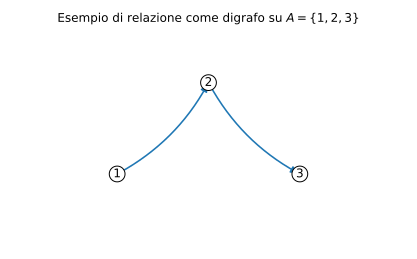
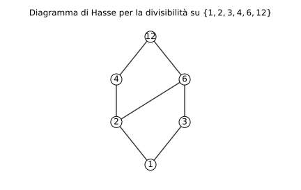

# Esempi ed esercizi — 1.3 Relazioni

Teoria: [1.3 Relazioni](../../01-concetti-di-base/1.3-relazioni.md)

---

## Esempi rapidi

### Esempio 1 (relazione e insieme di coppie)

Sia $A=\{1,2,3\}$ e
```math
R=\{(1,2),(2,3)\}\subseteq A\times A.
```

**Teoria usata.** [`01-concetti-di-base/1.3-relazioni.md`](../../01-concetti-di-base/1.3-relazioni.md) (definizione di relazione, relazione inversa).

- $(1,2)\in R$? sì.
- $(1,3)\in R$? no.
- $R^{-1}$?

**Soluzione.**
```math
R^{-1}=\{(2,1),(3,2)\}.
```

---

### Esempio 2 (rappresentazione con digrafo)

Considera la relazione su $A=\{1,2,3\}$:
```math
S=\{(1,2),(2,2),(2,3)\}.
```

**Teoria usata.** [`01-concetti-di-base/1.3-relazioni.md`](../../01-concetti-di-base/1.3-relazioni.md) (rappresentazione con digrafo, coppie in $A\times A$).

Nel digrafo i nodi sono gli elementi di $A$ e mettiamo una freccia $a\to b$ se $(a,b)\in S$.



---

## Esercizi

### Esercizio 1 (proprietà)

Sia $A=\{1,2,3\}$ e
```math
R=\{(1,1),(2,2),(3,3),(1,2),(2,1)\}.
```
Dire se $R$ è riflessiva, simmetrica, antisimmetrica, transitiva.

**Teoria usata.** [`01-concetti-di-base/1.3-relazioni.md`](../../01-concetti-di-base/1.3-relazioni.md) (riflessiva/simmetrica/antisimmetrica/transitiva).

**Soluzione (schema).**

- Riflessiva: sì (tutte le coppie $(x,x)$ ci sono).
- Simmetrica: sì (c’è $(1,2)$ e c’è $(2,1)$; gli altri sono diagonali).
- Antisimmetrica: no (perché $(1,2)$ e $(2,1)$ ma $1\ne 2$).
- Transitiva: sì (le uniche composizioni “non banali” sono $(1,2)$ con $(2,1)$ che richiede $(1,1)$, e $(2,1)$ con $(1,2)$ che richiede $(2,2)$; entrambe sono presenti).

---

### Esercizio 2 (equivalenza e quoziente)

Sia $A=\{1,2,3,4,5,6\}$ e $x\sim y$ se $x-y$ è pari.

1. Elenca le classi di equivalenza.
2. Scrivi $A/{\sim}$.

**Teoria usata.** [`01-concetti-di-base/1.3-relazioni.md`](../../01-concetti-di-base/1.3-relazioni.md) (relazioni di equivalenza, classi, quoziente).

**Soluzione.**

- $[1]=\{1,3,5\}$ e $[2]=\{2,4,6\}$.
- ```math
  A/{\sim}=\{\{1,3,5\},\{2,4,6\}\}.
  ```

---

### Esercizio 3 (ordine parziale)

Su $A=N\setminus\{0\}$, definiamo $xRy \iff x\mid y$.

1. Mostra che $R$ è un ordine parziale.
2. Mostra che non è un ordine totale.

**Teoria usata.** [`01-concetti-di-base/1.3-relazioni.md`](../../01-concetti-di-base/1.3-relazioni.md) (ordine parziale/totale, esempio “divide”).

**Soluzione (idea).**

1. Riflessiva: $x\mid x$; antisimmetrica: $x\mid y$ e $y\mid x$ implica $x=y$; transitiva: $x\mid y$ e $y\mid z$ implica $x\mid z$.
2. $2\nmid 3$ e $3\nmid 2$, quindi non vale la comparabilità per ogni coppia.

Rappresentazione (diagramma di Hasse) per la divisibilità sull’insieme $\{1,2,3,4,6,12\}$:



---

### Esercizio 4 (ordine totale su $R$)

Su $R$, la relazione $x\le y$ è un ordine totale?

**Teoria usata.** [`01-concetti-di-base/1.3-relazioni.md`](../../01-concetti-di-base/1.3-relazioni.md) (ordine totale).

**Soluzione.**  
Sì: è riflessiva ($x\le x$), antisimmetrica ($x\le y$ e $y\le x\Rightarrow x=y$), transitiva, e inoltre per ogni $x,y$ vale o $x\le y$ o $y\le x$ (comparabilità).


---

**Teoria usata.** [`01-concetti-di-base/1.3-relazioni.md`](../../01-concetti-di-base/1.3-relazioni.md)
