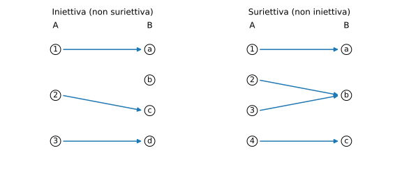

# Esempi ed esercizi — 1.4 Funzioni

Teoria: [1.4 Funzioni](../../01-concetti-di-base/1.4-funzioni.md)

---

## Esempio 1 (immagine e controimmagine)

**Teoria usata.** [`01-concetti-di-base/1.4-funzioni.md`](../../01-concetti-di-base/1.4-funzioni.md) (immagine, controimmagine).

Sia $f\colon R\to R$, $f(x)=x^2$.

1) Calcola $\mathrm{im}(f)$.  
2) Calcola $f^{-1}(\{4\})$.  
3) Calcola $f^{-1}([0,1])$.

**Soluzione.**

1) $\mathrm{im}(f)=[0,+\infty)$.  
2) $f^{-1}(\{4\})=\{-2,2\}$.  
3) $f^{-1}([0,1])=[-1,1]$.

---

## Esempio 2 (iniettiva / non iniettiva)

**Teoria usata.** [`01-concetti-di-base/1.4-funzioni.md`](../../01-concetti-di-base/1.4-funzioni.md) (iniettività).

Sia $f(x)=x^2$ su $R$. È iniettiva?

**Soluzione.**  
No: $f(1)=f(-1)=1$ ma $1\ne -1$.

Se invece restringiamo il dominio a $[0,+\infty)$, allora $f$ diventa iniettiva.

---

## Esempio 3 (suriettiva / non suriettiva)

**Teoria usata.** [`01-concetti-di-base/1.4-funzioni.md`](../../01-concetti-di-base/1.4-funzioni.md) (suriettività, immagine).

Sia $f\colon R\to R$, $f(x)=e^x$. È suriettiva?

**Soluzione.**  
No: $e^x>0$ per ogni $x$, quindi $\mathrm{im}(f)=(0,+\infty)\ne R$.

Se il codominio è $(0,+\infty)$ allora $f$ è suriettiva.

---

## Esempio 4 (biiettiva e inversa)

**Teoria usata.** [`01-concetti-di-base/1.4-funzioni.md`](../../01-concetti-di-base/1.4-funzioni.md) (biiettiva, inversa).

Sia $g\colon R\to R$, $g(x)=2x+1$.

Trova $g^{-1}$.

**Soluzione.**
```math
y=2x+1 \Rightarrow x=\frac{y-1}{2} \Rightarrow g^{-1}(y)=\frac{y-1}{2}.
```

---

## Esempio 5 (composizione)

**Teoria usata.** [`01-concetti-di-base/1.4-funzioni.md`](../../01-concetti-di-base/1.4-funzioni.md) (composizione).

Sia $f(x)=x+1$ e $g(x)=x^2$ su $R$.

```math
(g\circ f)(x)=(x+1)^2,\qquad (f\circ g)(x)=x^2+1.
```
In generale $g\circ f\ne f\circ g$.

---

## Esempio 6 (restrizione)

**Teoria usata.** [`01-concetti-di-base/1.4-funzioni.md`](../../01-concetti-di-base/1.4-funzioni.md) (restrizione).

Sia $f(x)=x^2$ su $R$. Considera la restrizione $f|_{[0,+\infty)}$.

Allora $f|_{[0,+\infty)}\colon [0,+\infty)\to [0,+\infty)$ è biiettiva e l’inversa è
```math
(f|_{[0,+\infty)})^{-1}(y)=\sqrt{y}.
```

---

## Esempio 7 (diagramma “a frecce”)

**Teoria usata.** [`01-concetti-di-base/1.4-funzioni.md`](../../01-concetti-di-base/1.4-funzioni.md) (iniettiva, suriettiva, biiettiva).

Esempi di rappresentazione di una funzione come “insieme di frecce” tra due insiemi:



---

## Esercizi

### Esercizio 1

Sia $h\colon R\setminus\{0\}\to R\setminus\{0\}$, $h(x)=1/x$.

1) È iniettiva?  
2) È suriettiva (sul codominio scelto)?  
3) Calcola $h^{-1}$.

**Teoria usata.** [`01-concetti-di-base/1.4-funzioni.md`](../../01-concetti-di-base/1.4-funzioni.md) (iniettiva/suriettiva/inversa).

### Esercizio 2

Sia $f\colon R\to R$, $f(x)=x^3$.

1) Mostra che $f$ è biiettiva.  
2) Trova $f^{-1}$.

**Teoria usata.** [`01-concetti-di-base/1.4-funzioni.md`](../../01-concetti-di-base/1.4-funzioni.md) (biiettiva/inversa).
