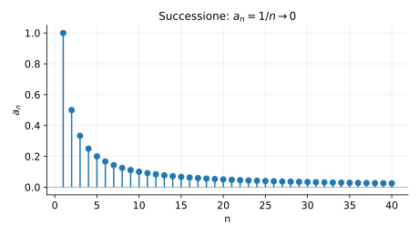
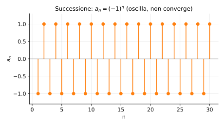

# Esempi ed esercizi — 2.1 Successioni

Teoria: [2.1 Successioni](../../02-successioni/2.1-successioni.md)

---

## Esempio 1 (limitata / non limitata)

**Teoria usata.** [`02-successioni/2.1-successioni.md`](../../02-successioni/2.1-successioni.md) (limitata).

- $a_n=(-1)^n$ è limitata perché $|a_n|=1$.
- $b_n=n$ non è limitata (cresce senza bound).

---

## Esempio 2 (monotonia)

**Teoria usata.** [`02-successioni/2.1-successioni.md`](../../02-successioni/2.1-successioni.md) (monotona).

Sia $a_n=1-\dfrac{1}{n+1}$.

Allora $a_{n+1}-a_n=\dfrac{1}{n+1}-\dfrac{1}{n+2}>0$, quindi è crescente.

---

## Esempio 3 (superiormente/inferiormente limitata)

**Teoria usata.** [`02-successioni/2.1-successioni.md`](../../02-successioni/2.1-successioni.md) (limitata sup/inf).

Sia $a_n=\dfrac{n}{n+1}$.

- inferiormente limitata da $0$,
- superiormente limitata da $1$.

---

## Esercizi

### Esercizio 1

Dire se $a_n=\dfrac{(-1)^n}{n+1}$ è limitata e se è monotona.

**Teoria usata.** [`02-successioni/2.1-successioni.md`](../../02-successioni/2.1-successioni.md).

### Esercizio 2

Dire se $a_n=\sqrt{n+1}-\sqrt{n}$ è limitata.

**Teoria usata.** [`02-successioni/2.1-successioni.md`](../../02-successioni/2.1-successioni.md).

---

## Grafici (intuizione)

**Teoria usata.** [`02-successioni/2.1-successioni.md`](../../02-successioni/2.1-successioni.md) (esempi di successioni: convergenti, divergenti, oscillanti).

Successione convergente:

Successione oscillante:

Successione geometrica:

---

**Teoria usata.** [`02-successioni/2.1-successioni.md`](../../02-successioni/2.1-successioni.md)
