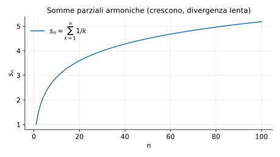

# Esempi ed esercizi — 2.2 Limiti di successioni

Teoria: [2.2 Limiti di successioni](../../02-successioni/2.2-limiti.md)

---

## Esempio 1 (algebra dei limiti)

**Teoria usata.** [`02-successioni/2.2-limiti.md`](../../02-successioni/2.2-limiti.md) (algebra dei limiti).

Se $a_n=\dfrac{3n+1}{n}=3+\dfrac{1}{n}$, allora
```math
\lim_{n\to\infty} a_n = 3.
```

---

## Esempio 2 (carabinieri)

**Teoria usata.** [`02-successioni/2.2-limiti.md`](../../02-successioni/2.2-limiti.md) (carabinieri).

Sia $a_n=\dfrac{\sin n}{n}$. Poiché $|\sin n|\le 1$:
```math
0\le \left|\frac{\sin n}{n}\right|\le \frac{1}{n}\to 0,
```
quindi $a_n\to 0$.

---

## Esempio 3 (monotona + limitata)

**Teoria usata.** [`02-successioni/2.2-limiti.md`](../../02-successioni/2.2-limiti.md) (successioni monotone).

Sia $a_n=\dfrac{n}{n+1}$.

- È crescente (si verifica con $a_{n+1}-a_n>0$).
- È limitata superiormente da 1.

Quindi converge; inoltre
```math
\lim_{n\to\infty}\frac{n}{n+1}=1.
```

---

## Esempio 4 (non convergenza via sottosuccessioni)

**Teoria usata.** [`02-successioni/2.2-limiti.md`](../../02-successioni/2.2-limiti.md) (sottosuccessioni).

Sia $a_n=(-1)^n$.  
Allora $a_{2n}=1$ e $a_{2n+1}=-1$: due sottosuccessioni convergono a limiti diversi, quindi $a_n$ non converge.

---

## Esercizi

### Esercizio 1

Calcolare $\lim_{n\to\infty} \sqrt[n]{n}$.

**Teoria usata.** [`02-successioni/2.2-limiti.md`](../../02-successioni/2.2-limiti.md) (limiti notevoli).

### Esercizio 2

Studiare la convergenza di $a_n=\dfrac{\ln(n)}{n}$.

**Teoria usata.** [`02-successioni/2.2-limiti.md`](../../02-successioni/2.2-limiti.md) (confronto, limiti notevoli).

---

## Esempio 5 (una successione che diverge: somme parziali armoniche)

Considera la successione delle somme parziali:
```math
s_n=\sum_{k=1}^{n}\frac{1}{k}.
```

**Teoria usata.** [`02-successioni/2.2-limiti.md`](../../02-successioni/2.2-limiti.md) (divergenza a $+\infty$ come “limite infinito”).

**Osservazione.**  
$s_n$ cresce senza bound (diverge a $+\infty$), anche se cresce lentamente.

Rappresentazione grafica:




---

**Teoria usata.** [`02-successioni/2.2-limiti.md`](../../02-successioni/2.2-limiti.md)
