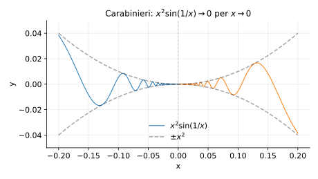
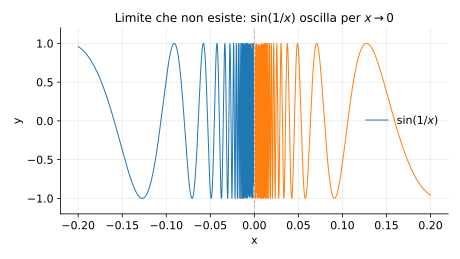
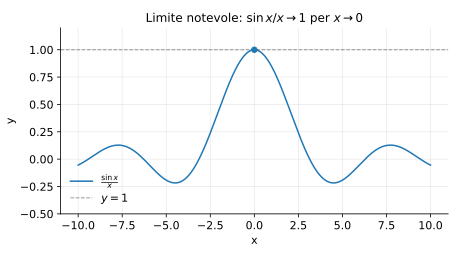

# Esempi ed esercizi — 3.1 Limiti di funzioni

Teoria: [3.1 Limiti di funzioni](../../03-limiti-continuita/3.1-limiti-funzioni.md)

---

## Esempio (carabinieri)

Mostrare che
```math
\lim_{x\to 0} x^2\sin\left(\frac{1}{x}\right)=0.
```

**Teoria usata.** [`03-limiti-continuita/3.1-limiti-funzioni.md`](../../03-limiti-continuita/3.1-limiti-funzioni.md) (teorema dei carabinieri, teoremi di confronto).

**Soluzione.**  
Per ogni $x\ne 0$ vale $|\sin(1/x)|\le 1$, quindi
```math
0\le \left|x^2\sin\left(\frac{1}{x}\right)\right|\le x^2.
```
Poiché $\lim_{x\to 0} x^2=0$, per carabinieri il limite è $0$.

Rappresentazione grafica (oscillazioni “schiacciate” verso $0$):



---

## Esempio (limite non esiste: criterio sequenziale)

Studiare il limite
```math
\lim_{x\to 0}\sin\left(\frac{1}{x}\right).
```

**Teoria usata.** [`03-limiti-continuita/3.1-limiti-funzioni.md`](../../03-limiti-continuita/3.1-limiti-funzioni.md) (criterio sequenziale per i limiti, limiti notevoli).

**Soluzione.**  
Prendiamo due successioni che vanno a $0$:
```math
x_n=\frac{1}{\frac{\pi}{2}+2\pi n}\to 0,\qquad
y_n=\frac{1}{\frac{3\pi}{2}+2\pi n}\to 0.
```
Allora
```math
\sin\left(\frac{1}{x_n}\right)=\sin\left(\frac{\pi}{2}+2\pi n\right)=1,\qquad
\sin\left(\frac{1}{y_n}\right)=\sin\left(\frac{3\pi}{2}+2\pi n\right)=-1.
```
Quindi, lungo due successioni che tendono a $0$, $f(x)$ tende a valori diversi: il limite non esiste.

Rappresentazione grafica (oscillazione infinita vicino a $0$):



---

## Esempio (limite notevole $\sin x/x$)

Calcolare
```math
\lim_{x\to 0}\frac{\sin x}{x}.
```

**Teoria usata.** [`03-limiti-continuita/3.1-limiti-funzioni.md`](../../03-limiti-continuita/3.1-limiti-funzioni.md) (3.1.1 limiti notevoli).

**Soluzione (idea).**  
È un limite notevole e vale $1$.

Rappresentazione grafica:



---

## Esercizi

### Esercizio 1

Calcolare
```math
\lim_{x\to 1}\frac{x^2-1}{x-1}.
```

**Teoria usata.** [`03-limiti-continuita/3.1-limiti-funzioni.md`](../../03-limiti-continuita/3.1-limiti-funzioni.md) (algebra dei limiti, fattorizzazioni).

**Soluzione.**  
Si fattorizza $x^2-1=(x-1)(x+1)$, quindi per $x\ne 1$:
```math
\frac{x^2-1}{x-1}=x+1.
```
Quindi il limite vale $2$.

### Esercizio 2

Calcolare
```math
\lim_{x\to 0}\frac{1-\cos x}{x^2}.
```

**Teoria usata.** [`03-limiti-continuita/3.1-limiti-funzioni.md`](../../03-limiti-continuita/3.1-limiti-funzioni.md) (3.1.1 limiti notevoli, equivalenze).

**Soluzione.**  
Usando il limite notevole $1-\cos x\sim x^2/2$ si ottiene:
```math
\lim_{x\to 0}\frac{1-\cos x}{x^2}=\frac{1}{2}.
```

### Esercizio 3

Calcolare
```math
\lim_{x\to 0}\frac{e^x-1}{x}.
```

**Teoria usata.** [`03-limiti-continuita/3.1-limiti-funzioni.md`](../../03-limiti-continuita/3.1-limiti-funzioni.md) (3.1.1 limiti notevoli, forme indeterminate).

**Soluzione.**  
È un limite notevole e vale $1$ (equivalentemente: $e^x=1+x+o(x)$).

### Esercizio 4

Calcolare
```math
\lim_{x\to 0} x\sin\left(\frac{1}{x}\right).
```

**Teoria usata.** [`03-limiti-continuita/3.1-limiti-funzioni.md`](../../03-limiti-continuita/3.1-limiti-funzioni.md) (teorema dei carabinieri).

**Soluzione.**  
Per $x\ne 0$ vale $|\sin(1/x)|\le 1$, quindi
```math
0\le \left|x\sin\left(\frac{1}{x}\right)\right|\le |x|\to 0,
```
e il limite è $0$.

### Esercizio 5

Calcolare
```math
\lim_{x\to 0}\frac{\sqrt{1+x}-1}{x}.
```

**Teoria usata.** [`03-limiti-continuita/3.1-limiti-funzioni.md`](../../03-limiti-continuita/3.1-limiti-funzioni.md) (razionalizzazione, algebra dei limiti).

**Soluzione.**  
Razionalizzando:
```math
\frac{\sqrt{1+x}-1}{x}\cdot \frac{\sqrt{1+x}+1}{\sqrt{1+x}+1}
=\frac{1+x-1}{x(\sqrt{1+x}+1)}
=\frac{1}{\sqrt{1+x}+1}\to \frac{1}{2}.
```


---

**Teoria usata.** [`03-limiti-continuita/3.1-limiti-funzioni.md`](../../03-limiti-continuita/3.1-limiti-funzioni.md)
