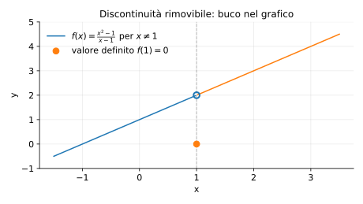
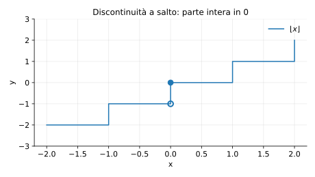
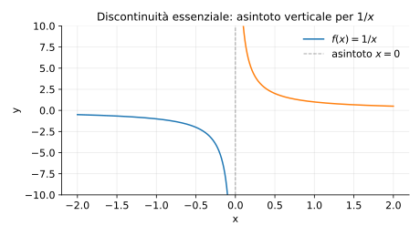

# Esempi ed esercizi — 3.2 Continuità

Teoria: [3.2 Continuità](../../03-limiti-continuita/3.2-continuita.md)

---

## Esempio (discontinuità rimovibile)

Sia
```math
f(x)=\begin{cases}
\frac{x^2-1}{x-1} & x\ne 1\\
0 & x=1.
\end{cases}
```

1. Classifica la discontinuità in $x=1$.
2. Ridefinisci $f(1)$ per rendere $f$ continua.

**Teoria usata.** [`03-limiti-continuita/3.2-continuita.md`](../../03-limiti-continuita/3.2-continuita.md) (definizione di continuità, discontinuità rimovibile) + `03-limiti-continuita/3.1-limiti-funzioni.md` (algebra dei limiti).

**Soluzione.**

Per $x\ne 1$, $f(x)=x+1$, quindi
```math
\lim_{x\to 1} f(x)=2.
```
Ma $f(1)=0$, quindi la discontinuità è **rimovibile**.  
Basta porre $\tilde f(1)=2$.

Rappresentazione grafica (buco in $(1,2)$ e valore “sbagliato” in $(1,0)$):



---

## Esempio (discontinuità a salto)

Sia $g(x)=\lfloor x\rfloor$ (parte intera). Studia la continuità in $x=0$.

**Teoria usata.** [`03-limiti-continuita/3.2-continuita.md`](../../03-limiti-continuita/3.2-continuita.md) (limiti laterali, discontinuità a salto).

**Soluzione.**  
```math
\lim_{x\to 0^-}\lfloor x\rfloor = -1,\qquad \lim_{x\to 0^+}\lfloor x\rfloor = 0,\qquad g(0)=0.
```
I limiti laterali esistono ma sono diversi: discontinuità **a salto**.

Rappresentazione grafica (salto in $0$):



---

## Esercizi

### Esercizio 1

Studiare la continuità di $h(x)=|x|$ in $x_0=0$.

**Teoria usata.** [`03-limiti-continuita/3.2-continuita.md`](../../03-limiti-continuita/3.2-continuita.md) (continuità in un punto) + `04-calcolo-differenziale/4.1-derivate.md` (esempio: $|x|$ continua ma non derivabile).

**Soluzione.**  
$|x|\to 0$ per $x\to 0$ e $h(0)=0$, quindi $h$ è continua in $0$.

### Esercizio 2

Sia $p(x)=\dfrac{1}{x}$. È continua su $(0,+\infty)$?

**Teoria usata.** [`03-limiti-continuita/3.2-continuita.md`](../../03-limiti-continuita/3.2-continuita.md) (continuità di funzioni “note”: razionali dove definite).

**Soluzione.**  
Sì: è una funzione razionale e il denominatore è sempre $\ne 0$ su $(0,+\infty)$.

Rappresentazione grafica (asintoto verticale in $0$):



---

### Esercizio 3

Studiare la continuità in $x=0$ della funzione
```math
q(x)=\begin{cases}
\sin x/x & x\ne 0\\
1 & x=0.
\end{cases}
```

**Teoria usata.** [`03-limiti-continuita/3.2-continuita.md`](../../03-limiti-continuita/3.2-continuita.md) (continuità tramite limite) + `03-limiti-continuita/3.1-limiti-funzioni.md` (limite notevole $\sin x/x$).

**Soluzione (idea).**  
Poiché $\lim_{x\to 0}\sin x/x=1$ e $q(0)=1$, la funzione è continua in $0$.

Rappresentazione grafica:


---

### Esercizio 4

Mostra che $r(x)=\sqrt{x^2+1}$ è continua su tutto $R$.

**Teoria usata.** [`03-limiti-continuita/3.2-continuita.md`](../../03-limiti-continuita/3.2-continuita.md) (composizione di funzioni continue).

**Soluzione (idea).**  
$x\mapsto x^2$ è continua, $x\mapsto x^2+1$ è continua, e $\sqrt{\cdot}$ è continua su $[0,+\infty)$; quindi la composizione è continua su $R$.


---

**Teoria usata.** [`03-limiti-continuita/3.2-continuita.md`](../../03-limiti-continuita/3.2-continuita.md)
