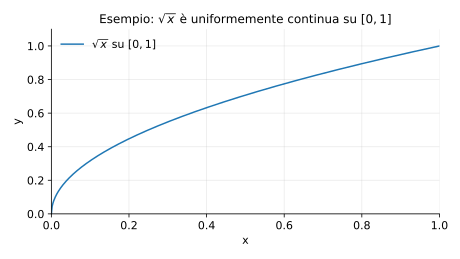
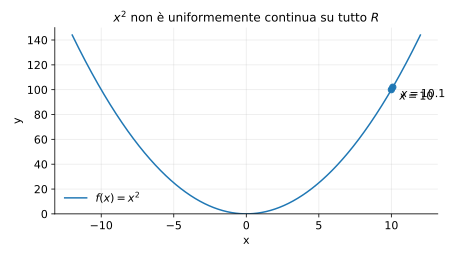
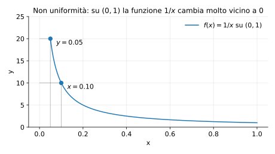

# Esempi ed esercizi — 3.3 Continuità uniforme

Teoria: [3.3 Continuità uniforme](../../03-limiti-continuita/3.3-continuita-uniforme.md)

---

## Esempio (Heine–Cantor)

Mostrare che $f(x)=\sqrt{x}$ è uniformemente continua su $[0,1]$.

**Teoria usata.** [`03-limiti-continuita/3.3-continuita-uniforme.md`](../../03-limiti-continuita/3.3-continuita-uniforme.md) (Heine–Cantor).

**Soluzione.**  
$f$ è continua su $[0,1]$ e $[0,1]$ è compatto, quindi per Heine–Cantor $f$ è uniformemente continua su $[0,1]$.

Rappresentazione grafica:



---

## Esempio (derivata limitata ⇒ uniforme)

Mostrare che $f(x)=\sin x$ è uniformemente continua su tutto $R$.

**Teoria usata.** [`03-limiti-continuita/3.3-continuita-uniforme.md`](../../03-limiti-continuita/3.3-continuita-uniforme.md) (derivata limitata ⇒ Lipschitz ⇒ uniforme).

**Soluzione.**  
$f$ è derivabile e $|f'(x)|=|\cos x|\le 1$ per ogni $x$.  
Su un intervallo (qui su tutto $R$) una derivata limitata implica Lipschitz:
```math
|\sin x-\sin y|\le |x-y|.
```
Quindi $f$ è Lipschitz, dunque uniformemente continua.

---

## Esercizi

### Esercizio 1

Mostrare che $f(x)=x^2$ non è uniformemente continua su $R$.

**Teoria usata.** [`03-limiti-continuita/3.3-continuita-uniforme.md`](../../03-limiti-continuita/3.3-continuita-uniforme.md) (criterio con successioni, controesempi).

**Soluzione (idea).**  
Prendi $x_n=n$ e $y_n=n+1/n$. Allora $|x_n-y_n|=1/n\to 0$, ma
```math
|x_n^2-y_n^2| = |n^2-(n+1/n)^2| = |2+1/n^2|\to 2 \ne 0.
```
Quindi non può esistere una $\delta$ che funzioni per tutti i punti.

Rappresentazione grafica:



### Esercizio 2

È uniformemente continua $f(x)=1/x$ su $[1,+\infty)$?

**Teoria usata.** [`03-limiti-continuita/3.3-continuita-uniforme.md`](../../03-limiti-continuita/3.3-continuita-uniforme.md) (derivata limitata su un intervallo ⇒ Lipschitz ⇒ uniforme).

**Soluzione (idea).**  
Sì: $f$ è derivabile e $|f'(x)|=1/x^2\le 1$ per ogni $x\ge 1$, quindi è Lipschitz su $[1,+\infty)$ e quindi uniformemente continua.

---

### Esercizio 3

Mostrare che $f(x)=1/x$ **non** è uniformemente continua su $(0,1)$.

**Teoria usata.** [`03-limiti-continuita/3.3-continuita-uniforme.md`](../../03-limiti-continuita/3.3-continuita-uniforme.md) (controesempio con punti vicini).

**Soluzione (idea).**  
Per $x$ vicino a $0$ la funzione cresce molto: si possono trovare $x,y$ molto vicini ma con $|f(x)-f(y)|$ grande.

Rappresentazione grafica:




---

**Teoria usata.** [`03-limiti-continuita/3.3-continuita-uniforme.md`](../../03-limiti-continuita/3.3-continuita-uniforme.md)
