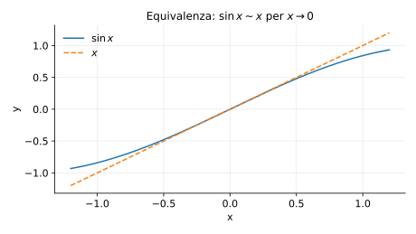
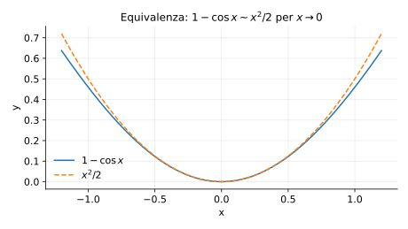

# Esempi ed esercizi — 3.4 Infinitesimi, infiniti, $o/O/\sim$

Teoria: [3.4 Infinitesimi e infiniti](../../03-limiti-continuita/3.4-infinitesimi-infiniti.md)

---

## Esempio (sostituzione con equivalenza)

Calcolare
```math
\lim_{x\to 0}\frac{\sin x}{x}.
```

**Teoria usata.** [`03-limiti-continuita/3.4-infinitesimi-infiniti.md`](../../03-limiti-continuita/3.4-infinitesimi-infiniti.md) (equivalenza $\sim$, sostituzioni) + `03-limiti-continuita/3.1-limiti-funzioni.md` (limite notevole).

**Soluzione.**  
Poiché $\sin x\sim x$ per $x\to 0$, allora
```math
\frac{\sin x}{x}\sim \frac{x}{x}=1,
```
quindi il limite è $1$.

Rappresentazione grafica (vicino a $0$):



---

## Esempio (termine trascurabile)

Calcolare
```math
\lim_{x\to 0}\frac{x+\sin x}{x}.
```

**Teoria usata.** [`03-limiti-continuita/3.4-infinitesimi-infiniti.md`](../../03-limiti-continuita/3.4-infinitesimi-infiniti.md) ($o(\cdot)$, equivalenze).

**Soluzione.**  
$\sin x\sim x$, quindi $x+\sin x\sim x+x=2x$ e
```math
\lim_{x\to 0}\frac{x+\sin x}{x}=2.
```

---

## Esempio (equivalenza con $1-\cos x$)

Calcolare
```math
\lim_{x\to 0}\frac{1-\cos x}{x^2}.
```

**Teoria usata.** [`03-limiti-continuita/3.4-infinitesimi-infiniti.md`](../../03-limiti-continuita/3.4-infinitesimi-infiniti.md) (equivalenze) + `03-limiti-continuita/3.1-limiti-funzioni.md` (limite notevole).

**Soluzione.**  
Poiché $1-\cos x\sim x^2/2$, si ottiene $\frac{1}{2}$.

Rappresentazione grafica (vicino a 0, confronto con $x^2/2$):



---

## Esercizi

### Esercizio 1

Mostrare che $x=o(\sqrt{x})$ per $x\to 0^+$.

**Teoria usata.** [`03-limiti-continuita/3.4-infinitesimi-infiniti.md`](../../03-limiti-continuita/3.4-infinitesimi-infiniti.md) (definizione di $o(\cdot)$).

**Soluzione.**  
```math
\frac{x}{\sqrt{x}}=\sqrt{x}\to 0.
```

### Esercizio 2

Calcolare
```math
\lim_{x\to 0}\frac{\ln(1+x)}{x}.
```

**Teoria usata.** [`03-limiti-continuita/3.4-infinitesimi-infiniti.md`](../../03-limiti-continuita/3.4-infinitesimi-infiniti.md) (equivalenze) + `03-limiti-continuita/3.1-limiti-funzioni.md` (limite notevole).

**Soluzione.**  
$\ln(1+x)\sim x$, quindi il limite è $1$.

### Esercizio 3

Mostrare che $\sin x = O(x)$ per $x\to 0$.

**Teoria usata.** [`03-limiti-continuita/3.4-infinitesimi-infiniti.md`](../../03-limiti-continuita/3.4-infinitesimi-infiniti.md) (definizione di $O(\cdot)$).

**Soluzione (idea).**  
Vicino a $0$, $|\sin x|\le |x|$, quindi esiste una costante $C$ (ad esempio $C=1$) tale che $|\sin x|\le C|x|$ per $x$ sufficientemente vicino a $0$.

### Esercizio 4

Calcolare
```math
\lim_{x\to 0}\frac{e^x-(1+x)}{x^2}.
```

**Teoria usata.** [`03-limiti-continuita/3.4-infinitesimi-infiniti.md`](../../03-limiti-continuita/3.4-infinitesimi-infiniti.md) (sviluppi di Taylor/Peano, termini $o(\cdot)$) + `04-calcolo-differenziale/4.2-teoremi-taylor.md` (sviluppo di $e^x$).

**Soluzione (idea).**  
Poiché $e^x=1+x+\frac{x^2}{2}+o(x^2)$, il limite vale $\frac{1}{2}$.


---

**Teoria usata.** [`03-limiti-continuita/3.4-infinitesimi-infiniti.md`](../../03-limiti-continuita/3.4-infinitesimi-infiniti.md)
