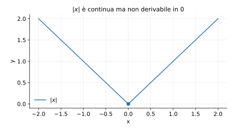
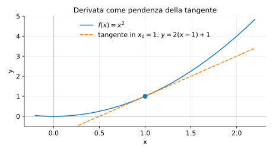

# Esempi ed esercizi — 4.1 Derivate

Teoria: [4.1 Derivate](../../04-calcolo-differenziale/4.1-derivate.md)

---

## Esempio (non derivabilità di $|x|$ in 0)

Sia $f(x)=|x|$. Calcolare $f'_+(0)$ e $f'_-(0)$.

**Teoria usata.** [`04-calcolo-differenziale/4.1-derivate.md`](../../04-calcolo-differenziale/4.1-derivate.md) (derivata destra/sinistra, definizione).

**Soluzione.**

Per $h>0$:
```math
\frac{f(0+h)-f(0)}{h}=\frac{|h|-0}{h}=\frac{h}{h}=1 \Rightarrow f'_+(0)=1.
```
Per $h<0$:
```math
\frac{|h|-0}{h}=\frac{-h}{h}=-1 \Rightarrow f'_-(0)=-1.
```
Quindi $f$ non è derivabile in $0$.

Rappresentazione grafica (angolo in $0$):



---

## Esempio (derivata e tangente per $x^2$)

Calcolare la derivata di $f(x)=x^2$ in $x_0=1$ dalla definizione e scrivere l’equazione della tangente.

**Teoria usata.** [`04-calcolo-differenziale/4.1-derivate.md`](../../04-calcolo-differenziale/4.1-derivate.md) (definizione di derivata, tangente).

**Soluzione.**
```math
f'(1)=\lim_{h\to 0}\frac{(1+h)^2-1}{h}
=\lim_{h\to 0}\frac{2h+h^2}{h}
=\lim_{h\to 0}(2+h)=2.
```
Tangente in $(1,1)$: $y-1=2(x-1)$, cioè $y=2x-1$.

Rappresentazione grafica (tangente):



---

## Esercizi

### Esercizio 1

Derivare $f(x)=\dfrac{x}{x^2+1}$ e studiare dove $f'(x)=0$.

**Teoria usata.** [`04-calcolo-differenziale/4.1-derivate.md`](../../04-calcolo-differenziale/4.1-derivate.md) (regole di derivazione, quoziente).

**Soluzione.**
```math
f'(x)=\frac{(x^2+1)-2x^2}{(x^2+1)^2}=\frac{1-x^2}{(x^2+1)^2}.
```
Quindi $f'(x)=0$ per $x=\pm 1$.

### Esercizio 2

Calcolare $(\ln(x^2+1))'$.

**Teoria usata.** [`04-calcolo-differenziale/4.1-derivate.md`](../../04-calcolo-differenziale/4.1-derivate.md) (catena).

**Soluzione.**  
Catena:
```math
(\ln(x^2+1))'=\frac{1}{x^2+1}\cdot 2x = \frac{2x}{x^2+1}.
```

### Esercizio 3

Studiare dove è derivabile $g(x)=|x-2|$ e calcolare $g'(x)$ dove esiste.

**Teoria usata.** [`04-calcolo-differenziale/4.1-derivate.md`](../../04-calcolo-differenziale/4.1-derivate.md) (derivata di funzioni definite a tratti, valore assoluto).

**Soluzione.**  
$g$ non è derivabile in $x=2$ (c’è un “angolo”). Per $x\ne 2$:
```math
g'(x)=\begin{cases}
-1 & x<2\\
1 & x>2.
\end{cases}
```


---

**Teoria usata.** [`04-calcolo-differenziale/4.1-derivate.md`](../../04-calcolo-differenziale/4.1-derivate.md)
