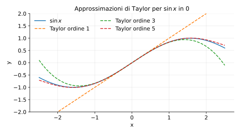
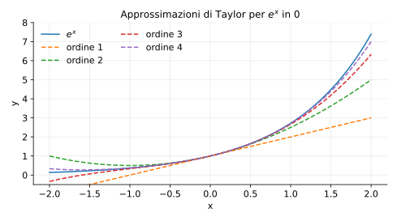

# Esempi ed esercizi — 4.2 Teoremi e Taylor

Teoria: [4.2 Teoremi + Taylor](../../04-calcolo-differenziale/4.2-teoremi-taylor.md)

---

## Esempio 1 (Rolle)

**Teoria usata.** [`04-calcolo-differenziale/4.2-teoremi-taylor.md`](../../04-calcolo-differenziale/4.2-teoremi-taylor.md) (Rolle).

Sia $f(x)=x^2-1$ su $[-1,1]$.  
Verifica le ipotesi e trova un $c$ con $f'(c)=0$.

**Soluzione.**

- $f$ è continua su $[-1,1]$ e derivabile su $(-1,1)$.
- $f(-1)=0$ e $f(1)=0$.
- $f'(x)=2x$, quindi $f'(c)=0$ per $c=0$.

---

## Esempio 2 (Lagrange: stima Lipschitz)

**Teoria usata.** [`04-calcolo-differenziale/4.2-teoremi-taylor.md`](../../04-calcolo-differenziale/4.2-teoremi-taylor.md) (Lagrange).

Mostra che $|\sin x-\sin y|\le |x-y|$ per ogni $x,y\in R$.

**Soluzione.**  
Applica Lagrange a $f(t)=\sin t$ su $[x,y]$:
```math
\sin x-\sin y = \cos(c)(x-y)
```
per qualche $c$ tra $x$ e $y$. Quindi
```math
|\sin x-\sin y|=|\cos(c)|\,|x-y|\le |x-y|.
```

---

## Esempio 3 (Taylor per un limite)

**Teoria usata.** [`04-calcolo-differenziale/4.2-teoremi-taylor.md`](../../04-calcolo-differenziale/4.2-teoremi-taylor.md) (Taylor di Peano).

Calcolare
```math
\lim_{x\to 0}\frac{e^x-1-x}{x^2}.
```

**Soluzione.**  
Per $x\to 0$:
```math
e^x = 1+x+\frac{x^2}{2}+o(x^2).
```
Quindi
```math
e^x-1-x=\frac{x^2}{2}+o(x^2)
```
e il limite vale $1/2$.

---

## Esempio 4 (de l’Hôpital: 0/0)

**Teoria usata.** [`04-calcolo-differenziale/4.2-teoremi-taylor.md`](../../04-calcolo-differenziale/4.2-teoremi-taylor.md) (de l’Hôpital, enunciato).

Calcolare
```math
\lim_{x\to 0}\frac{\ln(1+x)}{x}.
```

**Soluzione.**  
È una forma $0/0$. Applicando de l’Hôpital:
```math
\lim_{x\to 0}\frac{\ln(1+x)}{x}=\lim_{x\to 0}\frac{1/(1+x)}{1}=1.
```

---

## Esercizi

### Esercizio 1

Usare Taylor per calcolare
```math
\lim_{x\to 0}\frac{\sin x - x}{x^3}.
```

**Teoria usata.** [`04-calcolo-differenziale/4.2-teoremi-taylor.md`](../../04-calcolo-differenziale/4.2-teoremi-taylor.md).

### Esercizio 2

Usare Lagrange per dimostrare che $e^x$ è crescente su $R$.

**Teoria usata.** [`04-calcolo-differenziale/4.2-teoremi-taylor.md`](../../04-calcolo-differenziale/4.2-teoremi-taylor.md) (segno della derivata/monotonia via MVT).

---

## Grafici (Taylor)

**Teoria usata.** [`04-calcolo-differenziale/4.2-teoremi-taylor.md`](../../04-calcolo-differenziale/4.2-teoremi-taylor.md) (Taylor: approssimazione locale).

Confronto tra $\sin x$ e i polinomi di Taylor in $0$:



Confronto tra $e^x$ e i polinomi di Taylor in $0$:




---

**Teoria usata.** [`04-calcolo-differenziale/4.2-teoremi-taylor.md`](../../04-calcolo-differenziale/4.2-teoremi-taylor.md)
