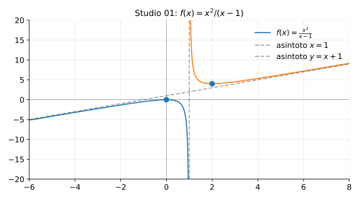

# Esempi ed esercizi — 4.4 Studio di funzione

Teoria: [4.4 Studio di funzione](../../04-calcolo-differenziale/4.4-studio-di-funzione.md)

---

## Esempio completo

Studiare qualitativamente
```math
f(x)=\frac{x^2}{x-1}.
```

**Teoria usata.** [`04-calcolo-differenziale/4.4-studio-di-funzione.md`](../../04-calcolo-differenziale/4.4-studio-di-funzione.md) (schema completo: dominio, limiti, asintoti, zeri, monotonia).

**Soluzione (schema).**

1) Dominio: $D=\mathbb{R}\setminus\{1\}$.  
2) Asintoto verticale: $x=1$ (perché $f(x)\to \pm\infty$ per $x\to 1^\pm$).  
3) Asintoto obliquo: divisione
```math
\frac{x^2}{x-1}=x+1+\frac{1}{x-1},
```
quindi $y=x+1$ è asintoto obliquo per $x\to\pm\infty$.  
4) Zeri: $x^2=0\Rightarrow x=0$ (zero doppio).  
5) Derivata:
```math
f'(x)=\frac{2x(x-1)-x^2}{(x-1)^2}=\frac{x(x-2)}{(x-1)^2}.
```
Punti critici: $x=0$ e $x=2$ (con $x=1$ escluso).  
Segno: $(x-1)^2>0$ su $D$, quindi il segno dipende da $x(x-2)$.

Rappresentazione grafica (asintoto verticale e obliquo):



---

## Esercizi

### Esercizio 1

Studiare $g(x)=\dfrac{1}{x^2-1}$: dominio, asintoti verticali, asintoto orizzontale.

**Teoria usata.** [`04-calcolo-differenziale/4.4-studio-di-funzione.md`](../../04-calcolo-differenziale/4.4-studio-di-funzione.md) (asintoti e studio di funzioni razionali).

### Esercizio 2

Studiare $h(x)=\dfrac{x}{x^2+1}$ (già visto negli esempi di derivate): monotonia e massimi/minimi.

**Teoria usata.** [`04-calcolo-differenziale/4.4-studio-di-funzione.md`](../../04-calcolo-differenziale/4.4-studio-di-funzione.md) (monotonia da $f'$, estremi locali).

---

## Altri studi completi (10 con grafici)

Se vuoi più esercizi “lunghi”, vedi: `esempi/04-calcolo-differenziale/studi-di-funzione/README.md`.


---

**Teoria usata.** [`04-calcolo-differenziale/4.4-studio-di-funzione.md`](../../04-calcolo-differenziale/4.4-studio-di-funzione.md)
