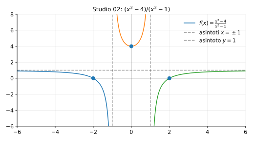

# Studio 02 — $f(x)=\dfrac{x^2-4}{x^2-1}$

**Teoria usata.** [`04-calcolo-differenziale/4.4-studio-di-funzione.md`](../../../04-calcolo-differenziale/4.4-studio-di-funzione.md) (dominio, simmetrie, segno, limiti e asintoti, monotonia, convessità).

Grafico: 

---

## 1) Dominio

```math
x^2-1\ne 0 \iff x\ne \pm 1 \quad\Rightarrow\quad D=\mathbb{R}\setminus\{-1,1\}.
```

---

## 2) Simmetrie

La funzione è pari:
```math
f(-x)=\frac{(-x)^2-4}{(-x)^2-1}=f(x).
```
Quindi il grafico è simmetrico rispetto all’asse $y$.

---

## 3) Zeri e segno

```math
f(x)=0 \iff x^2-4=0 \iff x=\pm 2 \quad (\text{ammessi}).
```

Studio del segno con fattorizzazione:
```math
f(x)=\frac{(x-2)(x+2)}{(x-1)(x+1)}.
```
I punti critici per il segno sono $-2,-1,1,2$.

---

## 4) Limiti e asintoti

### Asintoti verticali

In $x=1$ e $x=-1$ ci sono asintoti verticali (il denominatore va a 0 mentre il numeratore no).

### Asintoto orizzontale

Gradi uguali ⇒ asintoto orizzontale:
```math
\lim_{x\to\pm\infty}\frac{x^2-4}{x^2-1}=1,
```
quindi $y=1$.

---

## 5) Derivata prima: monotonia

```math
f'(x)=\frac{2x(x^2-1)-2x(x^2-4)}{(x^2-1)^2}=\frac{6x}{(x^2-1)^2}.
```

Poiché $(x^2-1)^2>0$ nel dominio, il segno di $f'$ dipende solo da $x$:

- $f'(x)<0$ per $x<0$ (decrescente),
- $f'(x)>0$ per $x>0$ (crescente).

In $x=0$:
```math
f(0)=\frac{-4}{-1}=4,
```
ed è un minimo/massimo? Poiché a sinistra decresce e a destra cresce, $x=0$ è un **minimo locale**.

---

## 6) Derivata seconda: concavità (indicazioni)

Derivando ancora:
```math
f''(x)=\frac{6( (x^2-1)^2 - x\cdot 2(x^2-1)\cdot 2x)}{(x^2-1)^4}.
```

In pratica, qui l’informazione più importante è già data da asintoti e monotonia; la concavità si può leggere dal grafico (simmetria + due asintoti verticali + asintoto orizzontale).

---

## 7) Riassunto finale

- Dominio: $R\setminus\{-1,1\}$, funzione pari.
- Zeri: $x=\pm 2$.
- Asintoti: verticali $x=\pm 1$, orizzontale $y=1$.
- Monotonia: decrescente su $(-\infty,-1)$ e $(-1,0)$; crescente su $(0,1)$ e $(1,+\infty)$.


---

**Teoria usata.** [`04-calcolo-differenziale/4.4-studio-di-funzione.md`](../../../04-calcolo-differenziale/4.4-studio-di-funzione.md) (dominio, simmetrie, segno, limiti e asintoti, monotonia, convessità).
