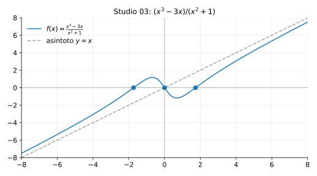

# Studio 03 — $f(x)=\dfrac{x^3-3x}{x^2+1}$

**Teoria usata.** [`04-calcolo-differenziale/4.4-studio-di-funzione.md`](../../../04-calcolo-differenziale/4.4-studio-di-funzione.md) (dominio, simmetrie, segno, asintoti, monotonia, convessità).

Grafico: 

---

## 1) Dominio

```math
x^2+1>0 \ \forall x \quad\Rightarrow\quad D=\mathbb{R}.
```

---

## 2) Simmetrie

La funzione è dispari (numeratore dispari, denominatore pari):
```math
f(-x)=\frac{-x^3+3x}{x^2+1}=-f(x).
```

---

## 3) Zeri e segno

```math
f(x)=0 \iff x(x^2-3)=0 \iff x=0,\ x=\pm\sqrt{3}.
```

---

## 4) Limiti e asintoti

Divisione:
```math
\frac{x^3-3x}{x^2+1}=x+\frac{-4x}{x^2+1}.
```
Quindi l’asintoto obliquo è
```math
y=x,
```
perché $\frac{-4x}{x^2+1}\to 0$ per $x\to\pm\infty$.

---

## 5) Derivata prima: monotonia

```math
f'(x)=\frac{(3x^2-3)(x^2+1)-(x^3-3x)\cdot 2x}{(x^2+1)^2}
     =\frac{x^4+6x^2-3}{(x^2+1)^2}.
```

Punti critici da
```math
x^4+6x^2-3=0.
```
Pongo $u=x^2$:
```math
u^2+6u-3=0 \Rightarrow u=-3\pm 2\sqrt{3}.
```
Solo $u=-3+2\sqrt{3}>0$ è accettabile, quindi
```math
x=\pm\sqrt{-3+2\sqrt{3}}.
```

Il segno di $f'$ si studia dal numeratore (denominatore sempre $>0$). Dal grafico si vede un massimo e un minimo simmetrici.

---

## 6) Derivata seconda (idea)

Qui la derivata seconda serve a confermare concavità e presenza di flessi; nella pratica d’esame spesso basta lo schema con $f'$ + asintoto obliquo.

---

## 7) Riassunto finale

- Dominio: $R$, funzione dispari.
- Zeri: $0,\pm\sqrt{3}$.
- Asintoto obliquo: $y=x$.
- Estremi: uno massimo e uno minimo simmetrici (punti critici $\pm\sqrt{-3+2\sqrt{3}}$).


---

**Teoria usata.** [`04-calcolo-differenziale/4.4-studio-di-funzione.md`](../../../04-calcolo-differenziale/4.4-studio-di-funzione.md) (dominio, simmetrie, segno, asintoti, monotonia, convessità).
