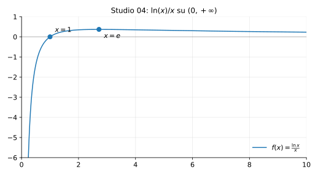

# Studio 04 — $f(x)=\dfrac{\ln x}{x}$

**Teoria usata.** [`04-calcolo-differenziale/4.4-studio-di-funzione.md`](../../../04-calcolo-differenziale/4.4-studio-di-funzione.md) (dominio, segno, limiti/asintoti, monotonia, estremi).

Grafico: 

---

## 1) Dominio

```math
\ln x \text{ è definito per } x>0,\quad x\ne 0 \Rightarrow D=(0,+\infty).
```

---

## 2) Zeri e segno

```math
f(x)=0 \iff \ln x = 0 \iff x=1.
```

- per $0<x<1$: $\ln x<0$ ⇒ $f(x)<0$;
- per $x>1$: $\ln x>0$ ⇒ $f(x)>0$.

---

## 3) Limiti e asintoti

```math
\lim_{x\to 0^+}\frac{\ln x}{x}=-\infty
```
(il logaritmo va a $-\infty$ e $x\to 0^+$).

```math
\lim_{x\to +\infty}\frac{\ln x}{x}=0
```
quindi asintoto orizzontale $y=0$ per $x\to+\infty$.

---

## 4) Derivata prima: monotonia ed estremi

```math
f'(x)=\left(\ln x\right)'\cdot \frac{1}{x}+\ln x\cdot \left(\frac{1}{x}\right)'
     =\frac{1}{x^2}-\frac{\ln x}{x^2}
     =\frac{1-\ln x}{x^2}.
```

Poiché $x^2>0$, il segno dipende da $1-\ln x$:

- $f'(x)>0$ se $\ln x<1 \iff x<e$;
- $f'(x)<0$ se $x>e$.

Quindi $f$ cresce su $(0,e)$ e decresce su $(e,+\infty)$.

Massimo in $x=e$:
```math
f(e)=\frac{1}{e}.
```

---

## 5) Derivata seconda (concavità)

```math
f''(x)=\left(\frac{1-\ln x}{x^2}\right)'=\frac{2\ln x-3}{x^3}.
```

Poiché $x^3>0$:

- concava se $2\ln x-3<0 \iff x<e^{3/2}$,
- convessa se $x>e^{3/2}$.

Quindi c’è un flesso in
```math
x=e^{3/2}.
```

---

## 6) Riassunto finale

- Dominio: $(0,+\infty)$.
- Zero: $x=1$.
- Limiti: $x\to 0^+$ dà $-\infty$; $x\to+\infty$ dà $0$.
- Massimo: in $x=e$ con valore $1/e$.
- Flesso: in $x=e^{3/2}$.


---

**Teoria usata.** [`04-calcolo-differenziale/4.4-studio-di-funzione.md`](../../../04-calcolo-differenziale/4.4-studio-di-funzione.md) (dominio, segno, limiti/asintoti, monotonia, estremi).
