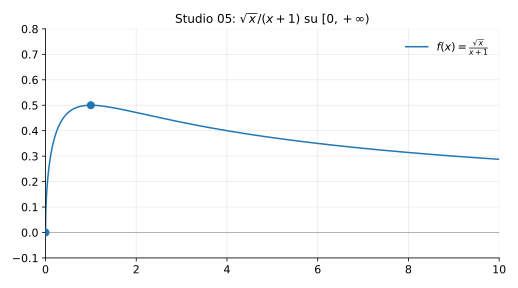

# Studio 05 — $f(x)=\dfrac{\sqrt{x}}{x+1}$

**Teoria usata.** [`04-calcolo-differenziale/4.4-studio-di-funzione.md`](../../../04-calcolo-differenziale/4.4-studio-di-funzione.md) (dominio, segno, limiti/asintoti, monotonia, estremi).

Grafico: 

---

## 1) Dominio

```math
\sqrt{x} \text{ richiede } x\ge 0,\quad x+1>0 \text{ per } x\ge 0
\Rightarrow D=[0,+\infty).
```

---

## 2) Zeri e segno

```math
f(x)=0 \iff \sqrt{x}=0 \iff x=0.
```
Per $x>0$, $f(x)>0$.

---

## 3) Limiti e asintoti

```math
\lim_{x\to +\infty}\frac{\sqrt{x}}{x+1}=0,
```
quindi asintoto orizzontale $y=0$.

---

## 4) Derivata prima: monotonia

Per $x>0$:
```math
f(x)=\frac{x^{1/2}}{x+1}\quad\Rightarrow\quad
f'(x)=\frac{\frac{1}{2}x^{-1/2}(x+1)-x^{1/2}}{(x+1)^2}
     =\frac{1-x}{2\sqrt{x}(x+1)^2}.
```

Nel dominio $x>0$ il denominatore è positivo, quindi:

- $f'(x)>0$ per $0<x<1$,
- $f'(x)=0$ per $x=1$,
- $f'(x)<0$ per $x>1$.

Quindi $f$ cresce su $(0,1)$ e decresce su $(1,+\infty)$.

Massimo in $x=1$:
```math
f(1)=\frac{1}{2}.
```

---

## 5) Riassunto finale

- Dominio: $[0,+\infty)$.
- Massimo: in $x=1$, valore $1/2$.
- Asintoto orizzontale: $y=0$ per $x\to+\infty$.


---

**Teoria usata.** [`04-calcolo-differenziale/4.4-studio-di-funzione.md`](../../../04-calcolo-differenziale/4.4-studio-di-funzione.md) (dominio, segno, limiti/asintoti, monotonia, estremi).
