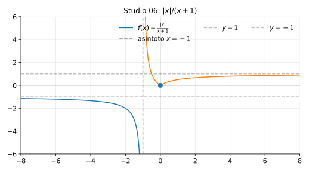

# Studio 06 — $f(x)=\dfrac{|x|}{x+1}$

**Teoria usata.** [`04-calcolo-differenziale/4.4-studio-di-funzione.md`](../../../04-calcolo-differenziale/4.4-studio-di-funzione.md) (dominio, studio a tratti, limiti/asintoti, monotonia).

Grafico: 

---

## 1) Dominio

```math
x+1\ne 0 \iff x\ne -1 \Rightarrow D=\mathbb{R}\setminus\{-1\}.
```

---

## 2) Definizione a tratti

```math
|x|=\begin{cases}
x & x\ge 0\\
-x & x<0
\end{cases}
```
quindi:

- per $x\ge 0$: $f(x)=\dfrac{x}{x+1}$,
- per $x<0$: $f(x)=\dfrac{-x}{x+1}$.

---

## 3) Asintoti

### Verticale

In $x=-1$ c’è asintoto verticale.

### Orizzontali

Per $x\to+\infty$:
```math
\frac{x}{x+1}\to 1 \Rightarrow y=1.
```
Per $x\to-\infty$:
```math
\frac{-x}{x+1}\to -1 \Rightarrow y=-1.
```

---

## 4) Continuità e derivabilità in 0

La funzione è continua in $0$ (si verifica dai due rami) e
```math
f(0)=0.
```

Non è derivabile in $0$ perché cambia formula (c’è un “angolo”).

---

## 5) Riassunto finale

- Dominio: $R\setminus\{-1\}$.
- Asintoto verticale: $x=-1$.
- Asintoti orizzontali: $y=1$ per $x\to+\infty$, $y=-1$ per $x\to-\infty$.
- Punto speciale: $x=0$ (cambio di ramo).


---

**Teoria usata.** [`04-calcolo-differenziale/4.4-studio-di-funzione.md`](../../../04-calcolo-differenziale/4.4-studio-di-funzione.md) (dominio, studio a tratti, limiti/asintoti, monotonia).
