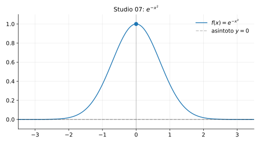

# Studio 07 — $f(x)=e^{-x^2}$

**Teoria usata.** [`04-calcolo-differenziale/4.4-studio-di-funzione.md`](../../../04-calcolo-differenziale/4.4-studio-di-funzione.md) (dominio e simmetrie, monotonia da $f'$, concavità da $f''$).

Grafico: 

---

## 1) Dominio e simmetria

Dominio: $D=\mathbb{R}$.

È pari:
```math
f(-x)=e^{-(-x)^2}=e^{-x^2}=f(x).
```

---

## 2) Valori e limiti

```math
f(0)=1,\qquad \lim_{x\to\pm\infty} e^{-x^2}=0.
```
Asintoto orizzontale: $y=0$.

---

## 3) Derivata prima (monotonia)

```math
f'(x)=e^{-x^2}\cdot (-2x)=-2x e^{-x^2}.
```

Poiché $e^{-x^2}>0$:

- per $x<0$, $-2x>0$ ⇒ $f'(x)>0$ (crescente),
- per $x>0$, $-2x<0$ ⇒ $f'(x)<0$ (decrescente).

Quindi massimo globale in $x=0$ con valore $1$.

---

## 4) Derivata seconda (concavità)

```math
f''(x)=(-2)e^{-x^2}+(-2x)(-2x)e^{-x^2}=(4x^2-2)e^{-x^2}.
```

Il segno dipende da $4x^2-2$:

- concava se $|x|<\frac{1}{\sqrt{2}}$,
- convessa se $|x|>\frac{1}{\sqrt{2}}$.

Flessi in:
```math
x=\pm\frac{1}{\sqrt{2}}.
```

---

## 5) Riassunto finale

- Massimo globale: $(0,1)$.
- Asintoto orizzontale: $y=0$.
- Flessi: $x=\pm 1/\sqrt{2}$.


---

**Teoria usata.** [`04-calcolo-differenziale/4.4-studio-di-funzione.md`](../../../04-calcolo-differenziale/4.4-studio-di-funzione.md) (dominio e simmetrie, monotonia da $f'$, concavità da $f''$).
