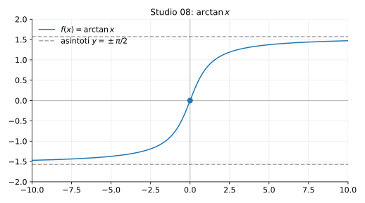

# Studio 08 — $f(x)=\arctan x$

**Teoria usata.** [`04-calcolo-differenziale/4.4-studio-di-funzione.md`](../../../04-calcolo-differenziale/4.4-studio-di-funzione.md) (dominio e simmetrie, limiti/asintoti, monotonia, concavità e flessi).

Grafico: 

---

## 1) Dominio e simmetria

Dominio: $D=\mathbb{R}$.

È dispari:
```math
\arctan(-x)=-\arctan x.
```

---

## 2) Limiti e asintoti orizzontali

```math
\lim_{x\to +\infty}\arctan x=\frac{\pi}{2},\qquad
\lim_{x\to -\infty}\arctan x=-\frac{\pi}{2}.
```
Quindi asintoti orizzontali:
```math
y=\pm\frac{\pi}{2}.
```

---

## 3) Derivata prima (monotonia)

```math
f'(x)=\frac{1}{1+x^2}>0 \quad \forall x,
```
quindi $f$ è strettamente crescente su $\mathbb{R}$.

---

## 4) Derivata seconda (concavità)

```math
f''(x)=\left(\frac{1}{1+x^2}\right)'=-\frac{2x}{(1+x^2)^2}.
```

- per $x<0$: $f''(x)>0$ (convessa),
- per $x>0$: $f''(x)<0$ (concava).

Flesso in $x=0$ (cambio di concavità) con $f(0)=0$.

---

## 5) Riassunto finale

- Crescente su tutto $\mathbb{R}$.
- Asintoti orizzontali: $y=\pm\pi/2$.
- Flesso: in $x=0$.


---

**Teoria usata.** [`04-calcolo-differenziale/4.4-studio-di-funzione.md`](../../../04-calcolo-differenziale/4.4-studio-di-funzione.md) (dominio e simmetrie, limiti/asintoti, monotonia, concavità e flessi).
