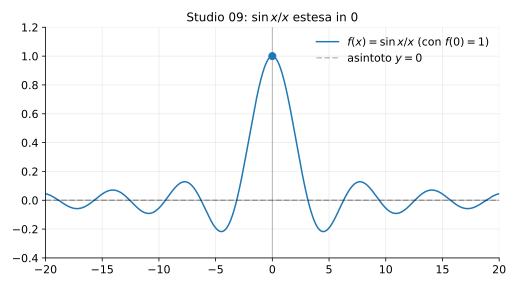

# Studio 09 — $f(x)=\dfrac{\sin x}{x}$ con $f(0)=1$

**Teoria usata.** [`04-calcolo-differenziale/4.4-studio-di-funzione.md`](../../../04-calcolo-differenziale/4.4-studio-di-funzione.md) (studio con estensione continua, simmetrie, zeri, limiti/asintoti).

Grafico: 

---

## 1) Dominio (con estensione)

La funzione $\sin x/x$ è definita per $x\ne 0$.  
Siccome
```math
\lim_{x\to 0}\frac{\sin x}{x}=1,
```
definiamo
```math
f(0)=1
```
per ottenere una funzione continua su tutto $\mathbb{R}$.

Quindi il dominio della funzione “estesa” è $D=\mathbb{R}$.

---

## 2) Simmetria

$f$ è pari:
```math
f(-x)=\frac{\sin(-x)}{-x}=\frac{\sin x}{x}=f(x).
```

---

## 3) Zeri

Per $x\ne 0$:
```math
\frac{\sin x}{x}=0 \iff \sin x=0 \iff x=k\pi,\ k\in\mathbb{Z},\ k\ne 0.
```

---

## 4) Limiti all’infinito

```math
|f(x)|=\left|\frac{\sin x}{x}\right|\le \frac{1}{|x|}\to 0 \quad (|x|\to\infty),
```
quindi $y=0$ è asintoto orizzontale (in senso di limite).

---

## 5) Riassunto finale

- Estensione continua in $0$ ponendo $f(0)=1$.
- Funzione pari, oscillante con ampiezza che tende a $0$.
- Zeri in $x=\pm\pi,\pm 2\pi,\dots$


---

**Teoria usata.** [`04-calcolo-differenziale/4.4-studio-di-funzione.md`](../../../04-calcolo-differenziale/4.4-studio-di-funzione.md) (studio con estensione continua, simmetrie, zeri, limiti/asintoti).
