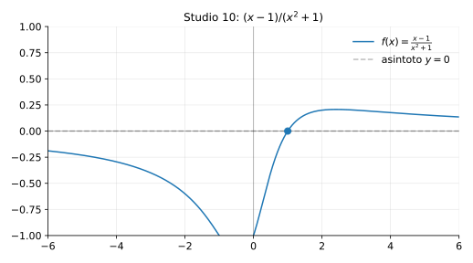

# Studio 10 — $f(x)=\dfrac{x-1}{x^2+1}$

**Teoria usata.** [`04-calcolo-differenziale/4.4-studio-di-funzione.md`](../../../04-calcolo-differenziale/4.4-studio-di-funzione.md) (dominio, segno, limiti/asintoti, monotonia ed estremi, concavità).

Grafico: 

---

## 1) Dominio

```math
x^2+1>0\ \forall x \Rightarrow D=\mathbb{R}.
```

---

## 2) Zeri e segno

```math
f(x)=0 \iff x-1=0 \iff x=1.
```

- per $x<1$: $f(x)<0$,
- per $x>1$: $f(x)>0$.

---

## 3) Limiti e asintoto orizzontale

```math
\lim_{x\to\pm\infty}\frac{x-1}{x^2+1}=0,
```
quindi $y=0$ è asintoto orizzontale.

---

## 4) Derivata prima (monotonia)

```math
f'(x)=\frac{(x^2+1)- (x-1)\cdot 2x}{(x^2+1)^2}
     =\frac{-x^2+2x+1}{(x^2+1)^2}.
```

Punti critici da $-x^2+2x+1=0$, cioè
```math
x^2-2x-1=0 \Rightarrow x=1\pm \sqrt{2}.
```

Il denominatore è sempre positivo, quindi il segno di $f'$ dipende dal numeratore.

---

## 5) Riassunto finale

- Dominio: $R$, asintoto orizzontale $y=0$.
- Zero in $x=1$.
- Punti critici in $x=1\pm\sqrt{2}$ (per monotonia ed estremi).


---

**Teoria usata.** [`04-calcolo-differenziale/4.4-studio-di-funzione.md`](../../../04-calcolo-differenziale/4.4-studio-di-funzione.md) (dominio, segno, limiti/asintoti, monotonia ed estremi, concavità).
