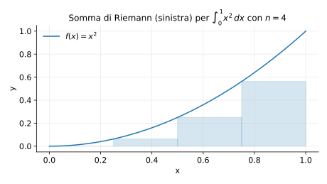

# Esempi ed esercizi — 5.1 Integrale di Riemann

Teoria: [5.1 Integrale di Riemann](../../05-integrali/5.1-integrale-riemann.md)

---

## Esempio 1 (integrale di una costante)

**Teoria usata.** [`05-integrali/5.1-integrale-riemann.md`](../../05-integrali/5.1-integrale-riemann.md) (integrale, interpretazione geometrica).

```math
\int_2^5 3\,dx = 3(5-2)=9.
```

---

## Esempio 2 (funzione a gradino)

**Teoria usata.** [`05-integrali/5.1-integrale-riemann.md`](../../05-integrali/5.1-integrale-riemann.md) (integrabilità di funzioni con poche discontinuità).

Sia
```math
f(x)=\begin{cases}
1 & 0\le x<1\\
2 & 1\le x\le 3.
\end{cases}
```
Allora:
```math
\int_0^3 f(x)\,dx = 1\cdot(1-0)+2\cdot(3-1)=1+4=5.
```

---

## Esempio 3 (upper/lower sums: idea)

**Teoria usata.** [`05-integrali/5.1-integrale-riemann.md`](../../05-integrali/5.1-integrale-riemann.md) (somme inferiori/superiori).

Per $f(x)=x$ su $[0,1]$ e partizione uniforme con $n$ sottointervalli:

- somma inferiore:
  ```math
  L_n=\sum_{k=0}^{n-1}\frac{k}{n}\cdot\frac{1}{n}=\frac{1}{n^2}\cdot\frac{(n-1)n}{2}=\frac{n-1}{2n},
  ```
- somma superiore:
  ```math
  U_n=\sum_{k=1}^{n}\frac{k}{n}\cdot\frac{1}{n}=\frac{1}{n^2}\cdot\frac{n(n+1)}{2}=\frac{n+1}{2n}.
  ```

E si vede che $U_n-L_n=1/n\to 0$, quindi $f$ è integrabile.

---

## Esempio 4 (somma di Riemann: rettangoli)

**Teoria usata.** [`05-integrali/5.1-integrale-riemann.md`](../../05-integrali/5.1-integrale-riemann.md) (somme di Riemann, interpretazione geometrica).

Per $f(x)=x^2$ su $[0,1]$, una somma di Riemann (a sinistra) con $n=4$ si visualizza così:



---

## Esercizi

### Esercizio 1

Calcolare $\int_0^2 (1+x)\,dx$.

**Teoria usata.** [`05-integrali/5.1-integrale-riemann.md`](../../05-integrali/5.1-integrale-riemann.md) (integrale e proprietà base).

### Esercizio 2

Spiega perché una funzione continua su $[a,b]$ è sempre Riemann-integrabile.

**Teoria usata.** [`05-integrali/5.1-integrale-riemann.md`](../../05-integrali/5.1-integrale-riemann.md) (criterio di integrabilità per funzioni continue).
