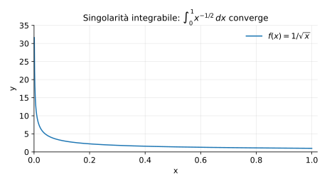

# Esempi ed esercizi — 5.5 Integrali impropri

Teoria: [5.5 Integrali impropri](../../05-integrali/5.5-integrali-impropri.md)

---

## Esempi

### Esempio 1 (test $p$)

Studiare la convergenza di
```math
\int_1^{+\infty}\frac{1}{x^p}\,dx.
```

**Teoria usata.** [`05-integrali/5.5-integrali-impropri.md`](../../05-integrali/5.5-integrali-impropri.md) (integrali su intervalli infiniti, test $p$).

**Soluzione.**  
Converge se e solo se $p>1$.

### Esempio 2 (singolarità)

Studiare
```math
\int_0^{1}\frac{1}{x^p}\,dx.
```

**Teoria usata.** [`05-integrali/5.5-integrali-impropri.md`](../../05-integrali/5.5-integrali-impropri.md) (singolarità al bordo, test $p$).

**Soluzione.**  
Converge se e solo se $p<1$.

Rappresentazione (esempio con $p=1/2$, singolarità integrabile):



---

## Esercizi

### Esercizio 1

Studiare la convergenza di
```math
\int_1^{+\infty}\frac{\ln x}{x^2}\,dx.
```

**Teoria usata.** [`05-integrali/5.5-integrali-impropri.md`](../../05-integrali/5.5-integrali-impropri.md) (confronto / confronto asintotico).

**Soluzione (idea).**  
Per $x\to+\infty$, $\ln x = o(x^\alpha)$ per ogni $\alpha>0$, quindi ad esempio $\ln x \le x^{1/2}$ per $x$ grande e
```math
\frac{\ln x}{x^2}\le \frac{x^{1/2}}{x^2}=\frac{1}{x^{3/2}},
```
che è integrabile su $[1,+\infty)$ ($p=3/2>1$). Quindi l’integrale converge.

### Esercizio 2

Studiare la convergenza di
```math
\int_0^{1}\frac{1}{\sqrt{x}(1+x)}\,dx.
```

**Teoria usata.** [`05-integrali/5.5-integrali-impropri.md`](../../05-integrali/5.5-integrali-impropri.md) (confronto vicino alla singolarità).

**Soluzione (idea).**  
Per $x\in(0,1)$ si ha $1+x\ge 1$, quindi
```math
0\le \frac{1}{\sqrt{x}(1+x)}\le \frac{1}{\sqrt{x}}.
```
Poiché $\int_0^1 x^{-1/2}\,dx$ converge, anche l’integrale dato converge.

### Esercizio 3

Studiare la convergenza di
```math
\int_0^1 \frac{1}{x}\,dx.
```

**Teoria usata.** [`05-integrali/5.5-integrali-impropri.md`](../../05-integrali/5.5-integrali-impropri.md) (test $p$ con singolarità al bordo).

**Soluzione.**  
Qui $p=1$ e l’integrale diverge (logaritmicamente).


---

**Teoria usata.** [`05-integrali/5.5-integrali-impropri.md`](../../05-integrali/5.5-integrali-impropri.md)
