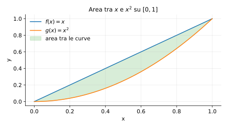

# Esempi ed esercizi — 5.6 Applicazioni degli integrali

Teoria: [5.6 Applicazioni](../../05-integrali/5.6-applicazioni.md)

---

## Esempio 1 (area tra due curve)

**Teoria usata.** [`05-integrali/5.6-applicazioni.md`](../../05-integrali/5.6-applicazioni.md) (area tra curve).

Area tra $y=x$ e $y=x^2$ su $[0,1]$:
```math
A=\int_0^1 (x-x^2)\,dx=\left[\frac{x^2}{2}-\frac{x^3}{3}\right]_0^1=\frac{1}{2}-\frac{1}{3}=\frac{1}{6}.
```

Rappresentazione grafica dell’area:



---

## Esempio 2 (volume di rotazione: dischi)

**Teoria usata.** [`05-integrali/5.6-applicazioni.md`](../../05-integrali/5.6-applicazioni.md) (metodo dei dischi).

Volume generato ruotando $y=x$ su $[0,1]$ attorno all’asse $x$:
```math
V=\pi\int_0^1 x^2\,dx=\pi\cdot\frac{1}{3}=\frac{\pi}{3}.
```

---

## Esempio 3 (lunghezza di curva)

**Teoria usata.** [`05-integrali/5.6-applicazioni.md`](../../05-integrali/5.6-applicazioni.md) (lunghezza).

Lunghezza del grafico di $y=x$ su $[0,1]$:
```math
L=\int_0^1 \sqrt{1+(1)^2}\,dx=\int_0^1 \sqrt{2}\,dx=\sqrt{2}.
```

---

## Esercizi

### Esercizio 1

Calcolare l’area sotto $y=\sin x$ su $[0,\pi]$.

**Teoria usata.** [`05-integrali/5.6-applicazioni.md`](../../05-integrali/5.6-applicazioni.md) (area sotto grafico).

### Esercizio 2

Calcolare il volume ruotando $y=\sqrt{x}$ su $[0,1]$ attorno all’asse $x$.

**Teoria usata.** [`05-integrali/5.6-applicazioni.md`](../../05-integrali/5.6-applicazioni.md) (dischi).
