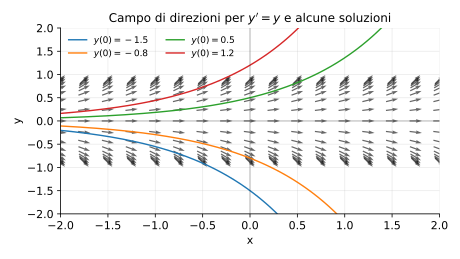

# Esempi ed esercizi — 6.1 Metodi EDO

Teoria: [6.1 Metodi risolutivi](../../06-equazioni-differenziali/6.1-metodi.md)

---

## Esempi svolti

### Esempio 1 (separabile)

Risolvere
```math
y' = xy,\qquad y(0)=1.
```

**Teoria usata.** [`06-equazioni-differenziali/6.1-metodi.md`](../../06-equazioni-differenziali/6.1-metodi.md) (equazioni separabili, problema di Cauchy).

**Soluzione.**  
Separazione:
```math
\frac{y'}{y}=x \Rightarrow \ln|y|=\frac{x^2}{2}+C \Rightarrow y=Ce^{x^2/2}.
```
Condizione iniziale: $1=C$, quindi $y=e^{x^2/2}$.

### Esempio 2 (lineare)

Risolvere
```math
y' + y = e^x.
```

**Teoria usata.** [`06-equazioni-differenziali/6.1-metodi.md`](../../06-equazioni-differenziali/6.1-metodi.md) (lineari del primo ordine, fattore integrante).

**Soluzione.**  
Fattore integrante $\mu=e^x$, quindi $(e^x y)'=e^{2x}$ e
```math
y=\frac{1}{2}e^x + Ce^{-x}.
```

### Esempio 3 (2° ordine a coefficenti costanti)

Risolvere
```math
y''-y=0.
```

**Teoria usata.** [`06-equazioni-differenziali/6.1-metodi.md`](../../06-equazioni-differenziali/6.1-metodi.md) (2° ordine lineari a coefficienti costanti, equazione caratteristica).

**Soluzione.**  
Equazione caratteristica $\lambda^2-1=0$, quindi $\lambda=\pm 1$ e
```math
y=C_1 e^x + C_2 e^{-x}.
```

---

## Grafico (campo di direzioni)

Esempio classico: per l’equazione $y'=y$ le soluzioni sono esponenziali e “seguono” il campo di direzioni:



---

## Esercizi

### Esercizio 1

Risolvere $y' = y(1-y)$ con dato iniziale $y(0)=y_0$ (separabile).

**Teoria usata.** [`06-equazioni-differenziali/6.1-metodi.md`](../../06-equazioni-differenziali/6.1-metodi.md) (separazione) + `06-equazioni-differenziali/6.3-studi-qualitativi.md` (equilibri per la logistic).

### Esercizio 2

Risolvere $y''+y=0$ e interpretare le soluzioni (seni e coseni).

**Teoria usata.** [`06-equazioni-differenziali/6.1-metodi.md`](../../06-equazioni-differenziali/6.1-metodi.md) (2° ordine a coefficienti costanti).

### Esercizio 3

Risolvere $y'=y$ con $y(0)=y_0$.

**Teoria usata.** [`06-equazioni-differenziali/6.1-metodi.md`](../../06-equazioni-differenziali/6.1-metodi.md) (separazione / equazione lineare semplice).
