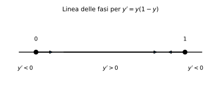

# Esempi ed esercizi — 6.3 Studio qualitativo (linea delle fasi)

Teoria: [6.3 Studi qualitativi](../../06-equazioni-differenziali/6.3-studi-qualitativi.md)

---

## Esempio 1 (equilibri e stabilità: logistic)

**Teoria usata.** [`06-equazioni-differenziali/6.3-studi-qualitativi.md`](../../06-equazioni-differenziali/6.3-studi-qualitativi.md) (equilibri, segno di $f$, stabilità).

Considera
```math
y'=y(1-y).
```

Equilibri:
```math
y(1-y)=0 \Rightarrow y^*=0,\ 1.
```

Segno:

- se $0<y<1$, allora $y'>0$ (sale verso 1),
- se $y>1$, allora $y'<0$ (scende verso 1),
- se $y<0$, allora $y'<0$ (scende).

Quindi $y^*=1$ è asintoticamente stabile, $y^*=0$ è instabile.

Rappresentazione (linea delle fasi):



---

## Esempio 2 (criterio con $f'(y^*)$)

**Teoria usata.** [`06-equazioni-differenziali/6.3-studi-qualitativi.md`](../../06-equazioni-differenziali/6.3-studi-qualitativi.md) (criterio con $f'(y^*)$).

```math
y'=f(y)=y-y^3.
```
Equilibri: $y^*=-1,0,1$.

```math
f'(y)=1-3y^2.
```
Quindi:

- $f'(0)=1>0$ ⇒ $0$ instabile,
- $f'(\pm 1)=1-3=-2<0$ ⇒ $\pm 1$ asintoticamente stabili.

---

## Esercizi

### Esercizio 1

Studiare qualitativamente $y'=-y(y-2)$: equilibri e stabilità.

**Teoria usata.** [`06-equazioni-differenziali/6.3-studi-qualitativi.md`](../../06-equazioni-differenziali/6.3-studi-qualitativi.md).

### Esercizio 2

Studiare qualitativamente $y'=y^2(1-y)$ (attenzione: equilibrio multiplo).

**Teoria usata.** [`06-equazioni-differenziali/6.3-studi-qualitativi.md`](../../06-equazioni-differenziali/6.3-studi-qualitativi.md).
